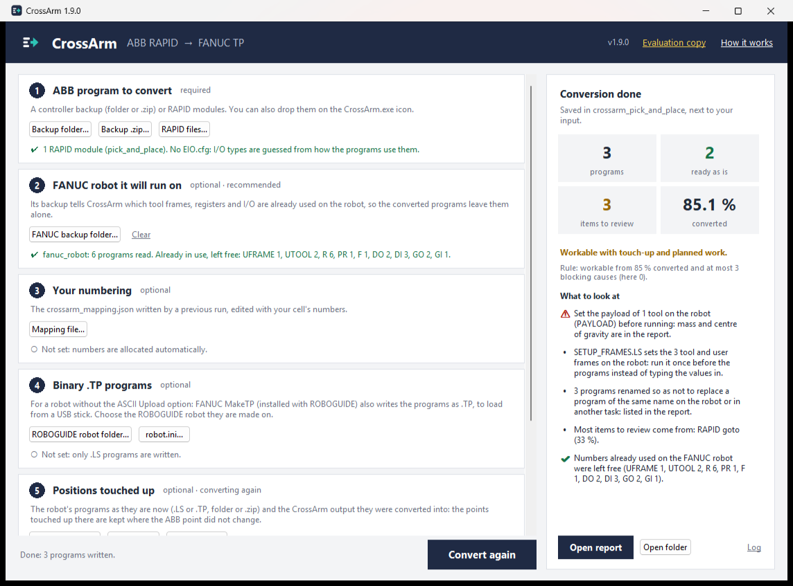

# CrossArm — ABB RAPID to FANUC TP converter

[](https://github.com/LeroyDu56/CrossArm/actions/workflows/tests.yml)
[](https://github.com/LeroyDu56/CrossArm/releases/latest)


[](LICENSE)

**CrossArm converts ABB robot programs written in RAPID into FANUC TP programs (`.LS`).** Give it a
RobotWare backup — or loose `.mod`, `.modx` and `.sys` modules — and it writes one FANUC program per
routine: motions, positions, tool and user frames, arm configuration, I/O, registers and program
logic. Alongside, a report lists everything that still needs a person. Nothing is guessed.

It is built for **robot migrations**. When a production cell moves from ABB to FANUC robots,
rewriting the programs by hand takes days per robot, and it is where mistakes slip in: a mistyped
frame, a swapped output, a posture that flips the wrist. CrossArm does the translation, fits the
numbering to the FANUC robot already in place, and tells you exactly what is left to do before
commissioning.

**[Download CrossArm.exe](https://github.com/LeroyDu56/CrossArm/releases/latest)** ·
[User guide](docs/guide.md) · [How it was validated](docs/validation.md) · [FAQ](#faq) ·
[Changelog](CHANGELOG.md)

| | |
|---|---|
| **Input** | ABB RobotWare 6 / 7 backup (folder or `.zip`), or RAPID modules (`.mod` `.modx` `.sys` `.sysx` `.prg`) |
| **Output** | FANUC TP programs as `.LS` text, an HTML conversion report, an editable numbering file |
| **Optional** | the backup of the FANUC robot the programs will run on, so its numbers and program names are left free |
| **Runs on** | Windows (`CrossArm.exe`, nothing to install) or any system with Python 3.11+ — entirely offline |
| **Licence** | Business Source License 1.1: free for evaluation and non-production use ([details](LICENSING.md)) |

## How to use it

Get **`CrossArm.exe`** from the [latest release](https://github.com/LeroyDu56/CrossArm/releases/latest):
nothing to install.



1. Choose the **ABB program**: a backup folder, a `.zip` or RAPID files.
2. Optionally, the **FANUC robot** it will run on (its backup): its frames, registers, I/O and
   program names are left alone, and its speeds and zones are used.
3. Optionally, **your numbering**: a `crossarm_mapping.json` from a previous run, edited with your
   cell's numbers.
4. **Convert.** The result says how many programs are ready as is and what to look at first.

The programs, the report and the numbering file land in a new `crossarm_<name>` folder next to the
input, with `SETUP_FRAMES.LS`, which sets every tool and user frame on the robot. Dropping the
backups on the icon converts them straight away. From the command line:
`crossarm convert abb_backup/ --fanuc fanuc_backup/` ([user guide](docs/guide.md#command-line)).

## An example

RAPID in, from [tests/fixtures/rapid/pick_and_place.mod](tests/fixtures/rapid/pick_and_place.mod):

```
PROC Pick()
    ! approach, grip, retract
    MoveJ Offs(pPick,0,0,100),v1000,z20,tGripper;
    MoveL pPick,v200,fine,tGripper;
    Set DO_GripperClose;
    WaitTime 0.3;
    MoveL Offs(pPick,0,0,100),v500,z10,tGripper;
ENDPROC
```

FANUC TP out, from [tests/fixtures/fanuc/pick_and_place/PICK.LS](tests/fixtures/fanuc/pick_and_place/PICK.LS):

```
/MN
   1:  !RAPID PickAndPlace.Pick ;
   2:  ! approach, grip, retract ;
   3:  UFRAME_NUM=0 ;
   4:  UTOOL_NUM=2 ;
   5:J P[1] 22% CNT55    ;
   6:L P[2] 200mm/sec FINE    ;
   7:  DO[1]=ON ;
   8:  WAIT    .30(sec) ;
   9:L P[1] 500mm/sec CNT54    ;
/POS
P[1]{
   GP1:
	UF : 0, UT : 2,		CONFIG : 'N U T, 0, 0, 1',
	X =   812.350  mm,	Y =  -245.100  mm,	Z =   405.000  mm,
	W =  -179.293 deg,	P =     0.000 deg,	R =   -90.000 deg
};
...
```

And the [report](tests/fixtures/fanuc/pick_and_place/crossarm_report.md) that goes with it.

## What it converts

- **Motion**: `MoveJ`, `MoveL`, `MoveC`, `MoveAbsJ` with their targets (`Offs`, `RelTool` included),
  the arm configuration, speeds and zones, tool and user frames, payloads (`GripLoad` included).
- **I/O**: digital, group and analog signals, typed by the backup's `EIO.cfg`, pulses, clocks; waits,
  including a wait with a time limit and its error handler.
- **Logic**: `IF`/`ELSEIF`, `TEST`/`CASE`, `FOR`, `WHILE`, conditions calling the backup's own functions, calls with
  num, bool, string and switch arguments, the integrator's own move routines.
- **Data**: `num` and `bool` to registers and flags; operator messages; comments.

Frames and points the programs compute are worked out at conversion time when every value they read
is fixed. Marked `!TODO` in the program and listed in the report, never guessed: other routine
parameters, frames and targets computed from data that changes at run time (calibrations included),
error handlers beyond wait timeouts, `TRAP`, analog I/O and a few ABB-specific instructions. The full table is in the [user guide](docs/guide.md#what-is-converted).

## What to expect

**The output is a starting point for commissioning, not a program to run blind.** Load the `.LS`
files in ROBOGUIDE or on the controller, set the payloads, check reachability, and work through
every `!TODO`.

**The points are theoretical, to be touched up on the robot.** They are the ABB's, carried over
exactly, but the FANUC robot is not where the ABB was, its tool is on another flange, and the cell
was never exact to the millimetre: every point is re-taught at commissioning, as on any robot swap.
What CrossArm sets out to do is give a program that goes where the ABB went, closely enough to be
touched up rather than rewritten: **within 10 mm of the ABB's path**, the way it moves included.
Measured, it stays within 4 mm.

**Limits:**
- Another robot model may need another posture, or may not reach a point at all: check reachability
  in ROBOGUIDE.
- An ABB tool goes on a FANUC robot through an adapter plate, which decides which way round the tool
  sits. CrossArm puts the tool's guide pin where it was on the ABB; `"tool_pin": "+x"` turns the
  tools for the ISO 9409-1 hole ([the tool on the flange](docs/guide.md#the-tool-on-the-flange)).
- Speeds and zones are measured per FANUC series: M-20iD (and ARC Mate 120iD), R-2000iC and
  R-1000iA. For another robot CrossArm uses the M-20iD's and says so
  ([speeds and zones](docs/guide.md#speeds-and-zones)).

## How it was validated

Where the two brands differ, CrossArm **measured** both controllers rather than assume, with an ABB
IRB 6700 in RobotStudio and FANUC robots in ROBOGUIDE, which runs the controller's own software:

| What | Result |
|---|---|
| Every program converted from the test corpus, loaded on a FANUC controller | 121 of 121 |
| Every form of instruction CrossArm writes, read back from the controller | stored as written (179 forms) |
| Flange pose, RobotStudio against ROBOGUIDE running the converted program | within 0.004 mm and 0.001° |
| Arm configuration (`confdata` → `CONFIG`) | the controller's own, on three FANUC robots (two edge cases, listed) |
| Joint moves, converted, against the ABB | −16 % to +19 % in time |
| Corners, approaches, retracts, reversals, zigzags, converted, against the ABB | the path within 4 mm |

Each probe runs again unattended on both simulators, and the tests fail if a change moves a result.
The details, probe by probe: [docs/validation.md](docs/validation.md).

## FAQ

### How do I convert an ABB RAPID program to FANUC TP?
Download [CrossArm.exe](https://github.com/LeroyDu56/CrossArm/releases/latest), choose the ABB backup
(folder or `.zip`) or the RAPID modules, optionally the backup of the FANUC robot the programs will
run on, and click **Convert**. The `.LS` programs, an HTML report and a numbering file are written
next to your input. From the command line: `crossarm convert abb_backup/ --fanuc fanuc_backup/`.

### Can RobotStudio or ROBOGUIDE convert programs between ABB and FANUC?
RobotStudio works in RAPID and ROBOGUIDE in TP and KAREL; neither is meant to translate the other
brand's programs. Offline programming tools generate programs for many brands from a path you draw;
translating an *existing* program — its logic, its I/O, its data — is a different job. CrossArm does
that job, and ROBOGUIDE is then the place to check its output before it goes to the robot.

### What is a FANUC `.LS` file?
The text form of a FANUC TP (teach pendant) program: a header, numbered instructions and the
positions they use. The controller runs the compiled `.TP`; ROBOGUIDE compiles a `.LS` into it, and
so can a controller that accepts ASCII programs. CrossArm writes `.LS` files and can read them back
byte for byte.

### Are the converted programs ready to run on the robot?
No, and CrossArm says so on every report. They are a starting point for commissioning: set the tool
payloads, check tool and user frames, check reachability on the new robot model, work through every
TODO, and touch up the points. ROBOGUIDE is the right place to do that before the real robot.

### How close to the ABB is the converted program?
The points are exactly the ABB's: the FANUC flange lands within 0.004 mm and 0.001° of where the ABB
put it. How the robot moves between them cannot be exact (a CNT is not a RAPID zone), so CrossArm
aims for a path within 10 mm of the ABB's. Measured against an IRB 6700 (corners on three FANUC
robots; approaches, retracts, reversals and zigzags on two), it stays within 4 mm, and on the way
down onto a part the FANUC keeps to the line at least as long as the ABB.

### How are ABB robtargets converted to FANUC positions?
The quaternion becomes W, P, R (fixed-axis XYZ angles), the position stays in millimetres in the
user frame, and ABB `confdata` becomes a FANUC `CONFIG` string through conventions measured on both
controllers. `Offs()` and `RelTool()` are resolved at conversion time; `MoveAbsJ` joints are mapped
axis by axis (the FANUC J3 is absolute, the wrist axes turn the other way).

### How does CrossArm number registers, I/O, frames and programs?
Automatically from 1, with one numbering per controller shared by all robot tasks. Given the backup
of the FANUC robot in place, it leaves that robot's numbers and program names alone. Every run
writes `crossarm_mapping.json`: edit it and convert again to use your cell's own numbers
([user guide](docs/guide.md#numbering-mapping-file-and-target-robot)).

### Does my backup leave my computer?
No. CrossArm runs entirely offline, reads only the files you give it and writes its output next to
them.

### Which versions are supported?
RAPID from RobotWare 6 and 7 backups (`.mod`, `.modx`, `.sys`, `.sysx`, `.prg`). On the FANUC side,
the `.LS` format as FANUC controllers and current ROBOGUIDE versions export it. The conventions
were measured against an IRB 6700 on an M-20iD/25, an R-2000iC/190S and an R-1000iA/80F; other
models should be checked in ROBOGUIDE.

### Is CrossArm free?
Free for evaluation, development, testing, teaching and personal projects. Production use —
programs that run on a real robot, conversions delivered to a customer, billed migration work —
needs a commercial licence. See [LICENSING.md](LICENSING.md).

### Can it convert FANUC to ABB, or KUKA and Yaskawa programs?
Not yet. CrossArm is built around a brand-neutral program model, and it can already read FANUC `.LS`
files back; other brands (KUKA KRL, Yaskawa INFORM) are on the [roadmap](#roadmap).

## Roadmap

Progress is measured as the share of RAPID instructions written as TP, on the three RobotWare
backups of the test corpus, written for testing in three integrators' styles and checked on the
controllers ([validation](docs/validation.md#1-the-test-corpus)): 81 %, 87 % and 80 %. What is left
gives the order of the next steps:

1. Routines with robtarget, string, record or INOUT parameters.
2. Operator dialogs and system functions (`UIMessageBox`, `OpMode()`), values only known at run time.
3. Error handlers for errors the backup raises itself (part not found, measure out of range).
4. Frames and positions measured on the robot (calibration, search): TP cannot compute a frame, so
   this needs KAREL. Those computed from fixed values are converted.

Further out: other brands behind the same program model (KUKA KRL, Yaskawa INFORM).

## Documentation

- [User guide](docs/guide.md): inputs and outputs, the full conversion table, the report, numbering
  and the mapping file, the tool on the flange, speeds and zones.
- [How it was validated](docs/validation.md): every probe and measurement.
- [FANUC `.LS` format status](docs/fanuc_ls_format.md) and [design notes](docs/design.md).
- [Contributing](CONTRIBUTING.md): bug reports, code layout, running the tests and the probes.
- [Changelog](CHANGELOG.md), with what 1.x keeps stable. To cite CrossArm, use **Cite this
  repository** on GitHub ([CITATION.cff](CITATION.cff)).

## License

CrossArm is published under the [Business Source License 1.1](LICENSE).

**Non-production use is free**: reading the code, building it, evaluating it on your own backups,
development, testing, teaching and personal projects.

**Production use requires a commercial licence** — converting programs that run on a real robot,
that are delivered to a customer, or that are part of billed migration work. See
[LICENSING.md](LICENSING.md) for where the line falls, and
[LICENSE-COMMERCIAL.md](LICENSE-COMMERCIAL.md) to get one. Contact: **enzoleroy56@gmail.com**.

Nothing is locked without a licence. The programs CrossArm writes then start with
`CrossArm EVALUATION copy`, and a commercial licence comes with a licence file that replaces that
mark with the licence number and company name.

Each released version becomes Apache 2.0 four years after it is published: v1.0.0 on 2030-09-26.
Versions published before 1.0.0 keep the licence they were published under.
Third-party components bundled in `CrossArm.exe`: [THIRD_PARTY_LICENSES.md](THIRD_PARTY_LICENSES.md).

FANUC, ROBOGUIDE and KAREL are trademarks of FANUC Corporation. ABB, RAPID, RobotStudio and
RobotWare are trademarks of ABB Ltd. **CrossArm is an independent project, not affiliated with or
endorsed by either company.** The `.LS` and RAPID formats were worked out by observing files and
controller round trips, for interoperability.
