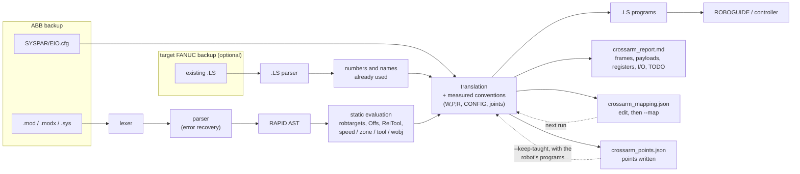

# CrossArm user guide

The [README](../README.md) says what CrossArm does. This guide covers how to use it in detail: what it
reads, what it writes, how to number the programs for your cell, and the choices it makes for you.
How each of those choices was checked is in [validation.md](validation.md).

- [Input: what CrossArm reads](#input-what-crossarm-reads)
- [The window](#the-window)
- [Command line](#command-line)
- [What is converted](#what-is-converted)
- [Reading the report](#reading-the-report)
- [Numbering: mapping file and target robot](#numbering-mapping-file-and-target-robot)
- [The tool on the flange](#the-tool-on-the-flange)
- [Speeds and zones](#speeds-and-zones)
- [How it works inside](#how-it-works-inside)

## Input: what CrossArm reads

An ABB RobotWare 6 or 7 backup (folder or `.zip`), or loose RAPID modules (`.mod`, `.modx`, `.sys`,
`.sysx`, `.prg`). CrossArm recognises the backup layout:
- each robot task (`T_ROB1`, `T_ROB2`...) becomes its own folder of programs;
- all tasks run on one controller, so they share its registers, flags, I/O and program names: two
  tasks never get the same number for different data, and a second `MAIN` is written `MAIN_2`;
- system modules are used as data, and `EIO.cfg` gives the I/O types;
- licences, binaries and other files are ignored.

Loose modules are one task, unless modules of the same name come from several folders (a folder per
robot task, or several versions of a program side by side): RAPID loads one module of a name per task,
so each of those folders is then converted as a task of its own, in a folder of the same name, and the
modules directly above go into each. Within a task, a routine name two modules declare (`LOCAL PROC`)
is converted once, from the first module, and the report says so for the other.

Optionally, the backup of the FANUC robot the programs will run on (folder, `.zip` or `.LS` files):
see [target robot](#the-fanuc-robot-in-place).

Everything is written to a new `crossarm_<name>` folder next to the input, a previous one never
overwritten:
- the `.LS` programs, one per routine;
- `SETUP_FRAMES.LS`: run once on the robot, it sets every tool and user frame of the report, so none
  has to be typed in on the pendant;
- the report, `crossarm_report.html` (and `.md`): see [reading the report](#reading-the-report);
- `crossarm_mapping.json`, the numbering used, to edit and give back;
- `crossarm_log.txt`;
- `crossarm_points.json`, every point written and the RAPID it came from, so that a later conversion keeps
  the touch-ups made on the robot ([converting again](#converting-again-keeping-the-touch-ups));
- when asked for, a `TP` folder of binary `.TP` programs ([binary .TP programs](#binary-tp-programs)).

Everything runs locally: no file leaves the computer.

## The window

`CrossArm.exe` walks through five steps, and each one says what it found before anything is
converted:

1. **ABB program to convert**: a backup folder, a `.zip` or RAPID files. CrossArm reports the robot
   tasks, the number of modules and whether `EIO.cfg` gave the I/O types.
2. **FANUC robot it will run on** (optional, recommended): its backup, so the frames, registers, I/O
   and program names already used on that robot are left alone.
3. **Your numbering** (optional): a `crossarm_mapping.json` from a previous run, edited with your
   cell's numbers.
4. **Binary .TP programs** (optional), for a robot without the ASCII Upload option: the ROBOGUIDE
   robot folder (`...\Robot_1`) of a robot like yours, or a `robot.ini` made by FANUC Setrobot,
   checked as soon as it is chosen ([binary .TP programs](#binary-tp-programs)).
5. **Positions touched up on the robot** (optional), when converting again a program already
   commissioned: **Robot programs...** (a folder of the robot's programs, or its backup), **Files or
   .zip...** (`.LS`, `.TP` or a `.zip`) and **Earlier output...** (the CrossArm output folder those programs
   were converted into, for its `crossarm_points.json`; a mapping file chosen in step 3 is looked beside
   too). The step says at once what it found: the programs read, the `.TP` to decode (with the robot of
   step 4), the points of the earlier conversion. **Clear** empties it
   ([converting again](#converting-again-keeping-the-touch-ups)).

On a small screen the steps scroll, and **Convert** stays at the bottom. Then **Convert**. The result
gives the decision of the [analysis](#the-analysis-first) (ready, workable or not ready) under its tiles,
how many programs are ready as is and what to look at first — anything that would stop the programs
loading or running comes before where the manual work is — with the touch-ups kept and to redo when step 5
was used, and the report one click away. **How it works** in the header explains the outputs and the limits
in plain words. Dropping the backups on the `CrossArm.exe` icon converts them straight away.

The executable is not code-signed. On first launch, SmartScreen may ask for confirmation
(**More info → Run anyway**). Each release ships the SHA-256 of the exe, built by GitHub Actions
from the tagged commit.

## Command line

Python 3.11 or later, no runtime dependency:

```bash
pip install -e ".[dev]"

crossarm convert tests/fixtures/rapid/pick_and_place.mod              # -> crossarm_pick_and_place/
crossarm convert path/to/backup.zip --fanuc path/to/fanuc_backup/      # number around the robot in place
crossarm convert path/to/backup.zip --map mapping.json                 # pin your own numbers
crossarm convert path/to/backup.zip --tp-robot path/to/Robot_1         # binary .TP too, made by FANUC MakeTP
crossarm convert new_backup.zip --keep-taught robot/ --keep-taught crossarm_old/   # keep the robot's touch-ups
crossarm-gui                                                           # the desktop window
crossarm parse   tests/fixtures/rapid/pick_and_place.mod              # RAPID AST as a readable listing
crossarm stats   backup/RAPID                                          # parser coverage report
```

### Binary .TP programs

A FANUC controller loads `.LS` programs only with the ASCII Upload option; without it, it loads the
binary `.TP`. `--tp` (or step 4 of the window) has FANUC MakeTP, installed with ROBOGUIDE
(`C:\Program Files (x86)\FANUC\WinOLPC\bin\maketp.exe`), make a `.TP` of every `.LS` written,
`SETUP_FRAMES` included, into a `TP` folder of the output: copy it to a USB stick and load the programs
from the FILE menu of the pendant. MakeTP makes them for a robot: `--tp-robot` names a ROBOGUIDE robot
folder (`...\Robot_1`, or a cell of one robot) or a `robot.ini` made by FANUC Setrobot; `--tp` alone takes
the `robot.ini` of the current folder. Choose a robot like yours, of the same software version: a
controller with older software may refuse them (not measured). MakeTP loads each program into that
robot's virtual controller: about 20 s a program, at once while its cell is open in ROBOGUIDE, but a
program of the same name in that cell is then removed. The report lists the `.TP` written and any `.LS`
MakeTP refused, with its reason; without MakeTP it says so, and the `.LS` are written as usual. Measured
on ROBOGUIDE: the `.TP` load and run, and decode back to the lines of their `.LS`
([validation](validation.md#33-binary-tp-programs-made-by-maketp-run)).

### Converting again: keeping the touch-ups

CrossArm's points are theoretical: they are touched up on the robot at commissioning. When the ABB program
changes later and the backup is converted again, the new programs would carry theoretical points over every
one of those touch-ups. `--keep-taught` (step 5 of the window) keeps them.

Every conversion writes `crossarm_points.json` next to its programs: each point written, named by the RAPID
it came from (routine, expression, and its rank when the routine writes it more than once), with its `P[n]`,
its frames and its theoretical value, and the values of the frames. A `.LS` alone does not say which `P[n]`
is which RAPID point, and P numbers move when a routine gains a point. A conversion made before 1.6 wrote no
such file: convert that old backup once with 1.6, with its mapping file, to get one.

`--keep-taught PATH` is given once per path:
- the robot's programs as they are now: a folder (a backup of the robot), a `.zip`, `.LS` files, or `.TP`
  files, which FANUC PrintTP, installed with ROBOGUIDE, decodes with the robot of `--tp-robot` (or the
  `robot.ini` of the current folder). Like MakeTP, PrintTP deletes a program of the same name in a cell open in
  ROBOGUIDE: name a robot whose cell is closed;
- the earlier CrossArm output folder, for its `crossarm_points.json`. Without it, the file is looked for next
  to the `--map` file; if there is none, CrossArm says what to add.

Each point of the new conversion gets a status, in the report and in the checklist:
- **kept**: touched up on the robot, and neither its ABB position nor its frames changed: its taught value
  (configuration and turns included) is written;
- **touch up again**: touched up, but its ABB position or one of its frames changed: the touch-up no longer
  fits, the new theoretical value is written, with why and how far the touch-up was from it;
- **theoretical**: the robot holds it as CrossArm wrote it (not touched up): written theoretical again;
- **new**: not in the earlier conversion; **gone**: in the earlier conversion, no longer written;
- **not read**: its program, or that `P[n]`, was not found or not readable among the robot's programs.

Two values are the same point within 0.01 mm and 0.01° (the `.LS` holds three decimals), with the same
configuration and turns. Not read: the points of arrays kept in position registers (the robot's registers
are not read, and `SETUP_FRAMES.LS` sets them theoretical again; the report counts them), and frames touched
up on the robot. Positions in the robot's programs that CrossArm did not write are listed, as the new
programs do not have them. Measured on ROBOGUIDE: a point touched up, the backup changed and converted
again, the robot goes to the touch-up kept and to the new point
([validation](validation.md#36-converting-again-the-touch-ups-kept-run)).

## What is converted

| RAPID | FANUC TP | Notes |
|---|---|---|
| `MoveJ` / `MoveL` / `MoveC` / `MoveAbsJ` | `J` / `L` / `C` / `J` + local `P[n]` | Targets resolved at conversion time, including `Offs()` and `RelTool()`. Joint targets converted with the measured axis conventions. A `MoveAbsJ` with a stationary tool is made with the tool already selected (a joint target does not depend on it) |
| frame or point the programs compute from fixed values: `tGrip:=MakeTool(tBase,sShift)`, `wB.uframe:=wA.uframe`, `DefFrame`, `PoseMult`, `OrientZYX`… | `UTOOL[n]=PR[m]` / `UFRAME[n]=PR[m]` where the RAPID computes it; a point, moved to with its value | Worked out at conversion time ([below](#frames-and-points-the-programs-compute)), the value kept in a position register `SETUP_FRAMES.LS` sets |
| robtarget quaternion | W, P, R | Fixed-axis XYZ angles |
| `confdata` | `CONFIG 'F/N U/D T/B, t1, t4, t6'` | Measured conventions ([validation](validation.md#3-arm-configuration-measured-on-both-controllers)) |
| `wobjdata` / `tooldata` | `UFRAME_NUM` / `UTOOL_NUM` | Frame values (X Y Z W P R) listed in the report. A frame the programs calibrate themselves: its value saved in the backup, flagged to check |
| tool load (`loaddata`) | PAYLOAD schedule | Mass, centre of gravity and inertia listed in the report, to set up before running |
| `GripLoad` | `PAYLOAD[n]` | A FANUC schedule is all the flange carries: the tool and the part together, worked out (common centre of gravity, inertia about it) and listed in the report. Numbered from the top down past the tools' own; `load0` selects the tool's schedule (its UTOOL number). The tool is the one the moves after it use, else the one selected, else the task's only tool |
| `speeddata` | `%` (joint) / `mm/sec` | mm/s kept; joint % from the target robot's measured profile ([speeds and zones](#speeds-and-zones)) |
| `zonedata` | `FINE` / `CNTn` | The CNT that rounds the corner as much at the move's speed, measured on both robots |
| `num` / `bool` / `byte` data | `R[n:name]` / `F[n]` | A `byte` is kept in a register as a `num` is |
| data of a `RECORD` type the backup declares: a state machine's `rCell.state:=2`, `MoveL p,rCell.move.speed,rCell.move.zone,...` | `R[12:rCell.state]=2`, a bool field `F[n]`, `L P[1] 400mm/sec CNT57` | TP has no records: each field a program changes is a register (a bool a flag) named by its path, a record set whole is set field by field (`F[3]=(F[2])` for a bool). A field no program changes is written as its value where it is read (a PERS at its saved value, with a warning). A speed or zone field is the speed or zone of the moves: the value every write gives it, when they all give the same (the routine that sets up the state machine), with a warning, and where it is read before that routine sets it. What changes a field: an assignment to it, to a record it is part of or to the whole data, a routine given the data to change, `Incr` / `Clear`, `SetDataVal`, code CrossArm does not read; in any task for a PERS, in its own task for a VAR. A record of a routine whose fields are all `num` and `bool` is set to its initial value where the routine starts, as RAPID does at each call (`R[3:COUNT.t.n]=0`). The mapping file names a field by its path (`rCell.state`, `Routine.data.field` for a routine's own); a field it does not name is numbered after every number it pins. The report gives the registers and flags each record takes |
| `Set` / `Reset` / `SetDO` | `DO[n]=ON/OFF` | Signal types read from the backup's `EIO.cfg` |
| `WaitTime`, `WaitDI/DO`, `WaitUntil` | `WAIT` | A `WaitTime` of a calculation (`WaitTime PERIOD-tSpent`) is worked out in a register first, then `WAIT R[n]` |
| `MoveLDO` / `MoveJDO` / `MoveCDO` to a fine point | `L P[1] 500mm/sec FINE`, then `DO[1]=ON` | The line after a FINE move runs with the robot on the point (measured: the output switches with the TCP 0.000 mm from it), where RAPID sets it. Through a zone RAPID sets it in the middle of the corner path: TODO |
| `SearchL \Stop,diProbe,pFound,pEnd,v50,tool` on a digital input | `SKIP CONDITION DI[1]=ON`, then `L P[2] 50mm/sec FINE Skip,LBL[2],PR[99]=LPOS` | The move stops where the input switches, the point found in a position register, read as any point known at run time (`Offs()`, its x, y, z). A search for a change (`\PosFlank`, the default, `\NegFlank`) first checks the input is not already at that level. `\Sup` or no stop option: the FANUC stops, then goes on to the point, where RAPID does not stop (warning). Where RAPID stops with an error (nothing found, the input already on), a `MESSAGE` and `PAUSE`, then the search again when resumed. **The FANUC stops past the switch and comes back to it, where RAPID stays past it: check the stopping distance at the search speed, mostly for a search by contact.** `\Flanks`, a search faster than 100 mm/s (the controller slows a move recording the position down to that: measured), a routine with an `ERROR` handler: TODO |
| `TestDI(di)`; `WaitRob \InPos` after a FINE move | `DI[n]=ON`; a remark | TP runs the line after a FINE move once the robot stands on the point: nothing to wait for. After a move through a zone, `WaitRob` stays TODO |
| wait with `\MaxTime` and `\TimeFlag` | the same loop, then `F[n]=(R[m:WaitTimer]>=2.5)` | RAPID raises no error then: the flag says whether the time ran out, no handler needed |
| wait with `\MaxTime` and the `ERROR` handler's `ERR_WAIT_MAXTIME` case | a loop on a `TIMER`, then the handler's steps (`RETRY` → back to the wait, `TRYNEXT` → past it) | `$WAITTMOUT`, the limit of `WAIT ... TIMEOUT`, is write-protected for programs. A handler that only passes errors on (`RAISE`) needs nothing on FANUC |
| `SetGO`, `GInput()`, a group input read by name | `GO[n]=…`, `GI[n]` | Group signals, typed by `EIO.cfg` |
| `PulseDO` | `DO[n]=PULSE,0.2sec` | Length in tenths of a second, 0.1 to 25.5 s (FANUC's range): rounded, with a warning when that moves it. `PULSE` sets the output ON whatever it was, as `PulseDO\High` |
| `InvertDO` | `DO[n]=(!DO[n])` | |
| `SetAO` | `AO[n]=counts` | A FANUC analog output takes the module's counts: give the counts per RAPID unit in the [mapping file](#the-mapping-file) (`analog_scales`); until then the line stays TODO |
| clocks: `ClkReset`, `ClkStart`, `ClkStop`, `ClkRead` | `TIMER[n]=RESET/START/STOP`, `R[m]=TIMER[n]` | In seconds, as `ClkRead`. The timer the waits with `\MaxTime` use is kept apart |
| `ConfL`, `ConfJ`, `SingArea`, `CirPathMode` | nothing | FANUC does without them: a warning where it does it its own way (`ConfL\Off`: each point keeps its `CONFIG`). `AccSet` / `VelSet` back to their defaults: nothing |
| `TPWrite` | `MESSAGE[…]` | 24 characters max. A value (`\Num`, `ValToStr`…) cannot be displayed: the text is kept and the report lists the value (`"tpwrite_values": "todo"` keeps a TODO instead) |
| `TPErase` | nothing | No equivalent on the FANUC pendant |
| `IF / ELSEIF / ELSE` | `IF (...) THEN / ELSE / ENDIF` | `ELSEIF` unrolled, negations pushed down |
| condition calling the backup's own bool function (`IF HasVision()=TRUE`) | the test the function makes: `IF (DI[5]=OFF)` | For a function that only returns a test, with a remark keeping the RAPID text. `RobOS()` is TRUE (the programs run on a real robot) |
| `FOR` (step ±1), `WHILE` | `FOR R[n]=a TO/DOWNTO b`, `LBL`/`JMP` loop | |
| a string the programs change: `sState:="IDLE"`, `IF sState="RUN" THEN`, `WHILE i<=StrLen(sWord)`, `ch:=StrPart(sWord,i,1)`, `sNum:=NumToStr(nCount,0)`, `nAt:=StrMatch(sWord,1,"ROBOT")`, `Show sState` | `CALL CA_TEXT(3,'IDLE',0)`, `IF SR[3]<>SR[25],JMP LBL[2]`, `R[4:Calc1]=STRLEN SR[2]`, `SR[1]=SUBSTR SR[2],R[5:i],1`, `SR[4]=R[6:nCount]`, `R[7]=FINDSTR SR[2],SR[25]`, `CALL SHOW(SR[3])` | Each string a program changes is a string register (`SR`, 25 on a standard controller), named like the data in the mapping file (`Routine.name` for a routine's own, set where the routine starts, as RAPID does at each call); one no program changes is its value. A TP line can neither write a text in a string register nor compare one with a text (ROBOGUIDE refuses `SR[3]='IDLE'`, `IF SR[3]='A',JMP`, `IF (SR[3]=SR[4]) THEN`): a text written in the program is loaded by `CA_TEXT`, a program written with the others (`SR[AR[1]]=AR[2]`; 38 characters at a time, a longer text in pieces added at the end; an apostrophe written as a backquote, with a warning), into a scratch register taken from the top just before it is compared or passed on, never kept from one instruction to the next. What a TRAP runs has scratch registers of its own (a TRAP can stop a program between loading a text and reading it), a routine both a TRAP and the programs run loads no text. A comparison is a jump, `IF SR[a]=SR[b],JMP LBL[n]`, the one form TP has: `IF` / `ELSEIF` / `ELSE`, `WHILE`, `AND`, `OR`, `NOT` on texts are written with jumps. TP compares texts regardless of case ('A' = 'a') but not of spaces: a comparison where the texts compared could differ by case alone stays TODO (what each string can hold is worked out from what the programs give it). `StrLen` is `STRLEN`; `StrPart` is `SUBSTR` (past the end both stop the program); `StrMatch` from the first character is `FINDSTR`, its 0 for not found set to RAPID's length+1; `NumToStr(n,0)` and `ValToStr(n)` are `SR=R` when the programs only ever give n whole numbers (TP writes a number held as a real with six decimals, `'3.000000'`). A text worked out for a call is passed in a scratch register, which the CALL copies |
| a bool set to a condition: `bOk:=nCount>2 AND NOT bBusy`, `bCopy:=bBusy`, `bOn:=sState="RUN"` | `F[2]=(R[1]>2 AND F[1]=OFF)`, `F[3]=(F[1])` | TP's mixed logic sets a flag to a condition (ROBOGUIDE: NOT, AND, OR, nested parentheses, outputs, registers and flags load and give the condition's value); a comparison of texts is the flag set OFF, then ON past the jump that skips it. Also a bool field of a record and a bool of a routine declared with a condition |
| `TEST` / `CASE` / `DEFAULT` | `SELECT R[n]=1,JMP LBL[2]` / `=2,CALL PICK` / `ELSE,JMP LBL[3]` | One line per `CASE` value; a `CASE` that only calls a routine calls it on its line, the other branches are behind labels. A `TEST` on an argument or a group input selects a copy (`R[n:TestValue]`). On a string, or with a `CASE` value only known at run time: TODO |
| `CONNECT` + `ISignalDI` / `ISignalDO`, `IPers`; `ISleep`, `IDelete`, `IWatch` | a condition program `WHEN DI[3]=ON+,CALL TSTOP` armed with `MONITOR ISTOP`; `MONITOR END ISTOP`, `MONITOR ISTOP` | The FANUC Condition Monitor function: one condition program per interrupt, named after it, `ON+` for 1, `OFF-` for 0, both for `edge`; `IPers` compares the data's register with a copy of the value last seen. The `TRAP` is a program without a motion group (and so is every routine it calls: it runs as a task of its own while the program it interrupted holds the robot); it arms its condition program again as it ends, as the controller disarms one when it fires, unless `\Single`. A `TRAP` several interrupts share, or one reading `INTNO`, is called through a relay per interrupt, which notes the interrupt in `R[n:IntNo]` (what `INTNO` reads; an `intnum` reads as its interrupt's number), calls the `TRAP` and arms its condition again. The program stops while the `TRAP` runs, the move under way goes on, as in RAPID. The controller checks the condition periodically: a change within 0.05 s of `MONITOR`, or held less than 0.02 s, can be missed (a warning says so). Data a `TRAP` changes is never taken as known |
| routine call, `Stop`, `RETURN`, `EXIT` | `CALL`, `PAUSE`, `END`, `ABORT` | A routine of a system module the programs call is written too: the robot needs it |
| routine with `num`, `bool`, `string`, switch parameters | `CALL NAME(3,(-2.5),1,0)`, `CALL FAULT('Gripper not open')`, read as `AR[n]` | Every argument on every call (a switch as 1 / 0). A parameter the routine changes is copied to a register; a `num` passed by reference (`INOUT`, `VAR`, `PERS`) the routine changes is read back by the caller after the CALL (`R[3:nBack]=R[4:n]`). A record of a type the backup declares is passed as the components the routine reads, each an argument of its own (`CALL DEBURRPART('HOUSING-120',2,35,.8,1)`), a PERS no program changes at its saved values. A tool or a work object is passed as its frame number and selected by the routine (`UTOOL_NUM=AR[1]`; an optional work object not given is 0, wobj0); the points it moves to with them are in position registers `SETUP_FRAMES` sets, as the controller refuses a P recorded in another tool than the one selected (INTP-253). A string is text written in the call, 38 characters at most; the routine cannot show it (`MESSAGE` takes fixed text), so a `TPWrite` of it stays TODO. A point (robtarget) goes in a position register of its own: the caller sets it (`PR[99]=P[1]`), the routine moves to it (`L PR[99]`) in the frames it selects; passed by reference (`VAR`, `INOUT`), the routine may change it there (`pAt:=Offs(pAt,0,50,0)`, `pAt.trans.z:=...`) and the caller reads it back after the CALL into the position register its own point is then kept in; `Offs()` of it is a copy offset component by component, `RelTool()` of it a move with `Tool_Offset,PR[m]` (the displacement and the turns, as W, P, R, in a copy of the point), and it can be passed on as it is or with `Offs()`. Other parameters (a frame used other than to move with, a record used whole...) stay TODO, with the reason |
| routine given its speed and zone: `PROC Approach(robtarget p,speeddata v,zonedata z)` making its `MoveJ`, `MoveL`, `MoveAbsJ` with them | `CALL APPROACH(400,9,100)`; in the routine `R[1:v.tcp]=AR[1]`, `L P[1] R[1]mm/sec CNT R[3]` | TP takes no argument as the speed or the CNT of a move (measured): the call passes the speed (mm/s, and % for joint moves) and the CNT of each corner, worked out as the move would be written with them, and the routine copies them to registers where it starts. `fine` given for the zone: the moves through it are FINE when every call gives it; when only some do, each is written both ways (`IF R[3]>100,JMP LBL[1]`, the move with `CNT R[3]`, else with `FINE`) and the call passes 101 for fine, as a CALL takes no negative number. Measured on both controllers: the moves take the time they take written with constants ([validation](validation.md#32-speeds-and-zones-given-to-a-routine-run)). `MoveC` and other uses of the speed or zone stay TODO |
| array of points indexed at run time: `MoveL pSlot{nTool}`, `pGrid{r,c}` in FOR loops | `PR[R[n]]` | `SETUP_FRAMES` keeps the array in consecutive position registers, row after row; the program works the index out in `R[n:PointIndex]` and reads `PR[R[n]]`, moved to, offset with `Offs()` or passed to a routine. An element at a fixed index is an ordinary point |
| array of numbers indexed at run time: `nTorque{nScrew}` | `R[R[n]]` | The same with numeric registers, read in calculations, conditions and arguments (`R[n:NumberIndex]`, a second one when a statement reads two elements). For both: a CONST array, or a PERS one no program changes, kept at the values saved in the backup (a warning says so) |
| array of numbers the programs change: `nCmd{4}:=nDetail-1`, `nGrid{i,j}:=i*10+j`, `Incr nCount{k}` | `R[186]=R[186]+1`, `R[R[3]]=R[4:Calc1]+R[2:j]` | The same block of registers: an element at a fixed index is its own register, one at an index known at run time `R[R[n]]` (an index of several operations worked out first). `SETUP_FRAMES` sets the values the array is declared with (zeros without), or saved with for a PERS, with a warning: on the FANUC the registers keep their values, where RAPID sets a VAR again when the program starts from main. The tasks of a backup share the block of a PERS array, as they share the PERS. An array of a routine or of strings (TP has 25 string registers) stays TODO |
| array of bools the programs change or index at run time: `bSlot{i}:=i>3`, `IF bSlot{k} ...` | `F[1022]=(ON)`, `F[R[4]]=(F[R[3]]=OFF)`, `IF (F[R[4]]=ON) THEN` | The same with a block of consecutive flags, from the top down: `SETUP_FRAMES` sets the values it is declared or saved with; the mapping file gives its first flag (`flag_arrays`) |
| call to a routine that makes one move (`MyMoveL p10,v500,z10,tool1`) | `L P[n] …` | Converted when the routine does nothing else; otherwise listed in the report and converted on request ([`move_routines`](#the-mapping-file)) |
| `Incr`, `Decr`, `Add`, `Clear` | `R[2]=R[2]+1`, `R[2]=R[2]-1`, `R[2]=R[2]+R[3]`, `R[2]=0` | |
| calculation of several operations: `nA:=(nB-1)*600+nC*3` | `R[2:Calc1]=R[3]-1`, `R[2:Calc1]=R[2:Calc1]*600`, `R[4:Calc2]=R[5]*3`, `R[1:nA]=R[2:Calc1]+R[4:Calc2]` | One operation per line in scratch registers: TP refuses `+` and `*` in one calculation. In assignments, conditions, arguments and `Offs()` / `RelTool()` offsets; a `WaitUntil` on one stays TODO (worked out once, it would not follow the data) |
| a number RAPID's math functions work out from data no program changes: `FOR i FROM 1 TO Pow(2, nRings) - 1` | the number: `FOR R[1:i]=1 TO 7` (`nRings` 3) | Worked out once at conversion, as TP has no such function (`Pow`, `Sqrt`, `Exp`, `Sin`, `Cos`, `ATan2`...): a PERS read at its saved value, with a warning. One that reads data the programs change stays TODO, saying where |
| a point worked out at run time: `pPlace:=Offs(pCorner,(nCol-1)*L,0,nLayer*H)`, `RelTool(pPlace,0,0,0\Rz:=90)`, `CRobT()`, `pPlace.trans.z:=...`, `MoveL Offs(pCorner,nCol*L,0,0)` | `PR[98]=P[1]`, `PR[98,1]=PR[98,1]+R[4:Calc1]`, `PR[98,6]=(-90)`, `PR[97]=LPOS`, `PR[98,3]=...`, `L PR[98]` | A robtarget set from data that changes at run time is kept in a position register every assignment sets and every move reads, in any routine. `RelTool()` of it when its orientation is known at conversion time (after `Offs()` of a fixed point); `CRobT()` in the frames its `\Tool` and `\WObj` name, selected first; without them, in a routine whose moves have not selected frames yet, `PR[k]=LPOS` in the frames selected when it runs, as RAPID reads in the active tool and work object, those of the last move. A point whose assignment stays TODO is never moved to |
| a jointtarget read on the robot: `jNow:=CJointT()`, `jNow.robax.rax_3`, `MoveAbsJ jNow` | `PR[99]=JPOS`, `R[4:Calc1]=PR[99,3]+PR[99,2]` then `R[4:Calc1]=R[4:Calc1]*(-1)`, `J PR[99]` | Kept in a joint position register. Each axis is read with the measured conventions, the ABB value: rax_1 = J1, rax_2 = J2, rax_3 = −(J3+J2), rax_4 = −J4, rax_5 = −J5, rax_6 = 180−J6 (−J6 with `"tool_pin": "+x"`; the raw FANUC joint with `"joint_mapping": false`), with a warning. `MoveAbsJ` to it is a joint move to the register, whatever tool is selected; a copy is `PR[m]=PR[k]`. External axes, writing an axis and a jointtarget set to a constant stay TODO. Measured on both controllers ([validation](validation.md#34-jointtargets-read-on-the-robot-run)) |
| `IF FALSE` / `WHILE FALSE`, `TEST` on a constant | a remark | Code switched off by hand: left out, `IF TRUE` converted without a test, a `TEST` on a constant as the branch it takes |
| comments | `!remark` | Split to 32 characters, accents folded to ASCII |

**Reported as TODO**:
- routines with other parameters (a frame used other than to move with or in a MoveAbsJ, a bool passed by
  reference, a record used whole, a speed or zone used in a `MoveC` or other than to move with), a
  string argument only known at run time, a VAR array no program sets indexed at run time, an array of a
  routine the routine changes, arrays of bools, strings and points the programs change, a
  point parameter passed on with `RelTool()` (TP has no pose product), `FUNC` doing more than return a test;
- frames computed from data that changes at run time, with that data and where it changes; `RelTool()` of a
  point whose orientation is only known at run time;
  frames **measured on the robot** (`CRobT`, a calibration), with what reads the robot; a position read on
  the robot that is not kept in a position register (an external axis of a `CJointT()`, a `pos` from
  `CPos()`), saying what TP reads;
- payload changes (`tool.tload`), to redo with the FANUC `PAYLOAD[n]` schedules;
- `AccSet` and `VelSet` that slow the robot down (dropping them would run it faster than the ABB), a
  `SetAO` without its scale; interrupts a condition monitor cannot watch (`ITimer`, `IError`, group and
  analog signals), `IDisable` / `IEnable`, a `TRAP` that moves the robot or controls its motion
  (`StopMove`, `ClearPath`...: it runs without a motion group);
- texts TP handles otherwise: a comparison where the texts could differ by case alone, `StrToVal` (TP
  reads 'ABC' as 0 and '12AB' as 12 where RAPID fails), `StrFind`, `StrMemb`, `StrOrder`, `StrMap`,
  `StrMatch` from another character than the first, a number with decimals written as a text, more than
  25 strings (listed), strings of records and arrays of strings, showing a text (`TPWrite`);
- analog inputs, error handlers beyond wait timeouts (FANUC has no exceptions), `UNDO`, `GOTO`, late
  binding; string, point and other fields of records, arrays of records, a speed or zone field set to
  several values, a record of a routine that calls itself back or with fields other than `num` and `bool`;
- RAPID instructions TP has nothing for, under a cause of their own in the report, "RAPID instruction
  without a TP equivalent", each with why: files and serial channels (`Open`, `Write`...), sockets,
  raw byte buffers, operator dialogs waiting for an answer (`TPReadFK`, `UIMessageBox`...), screens of
  the ABB pendant (`TPShow`), the ABB event log (`BookErrNo`, `ErrLog`...), system instructions
  (`Load`/`UnLoad`, `GetSysData`, `ActUnit`...), world zones (`WZBoxDef`...); what an operator dialog or a
  socket gave (`IF answer=resCancel`); a call to a routine of the backup that writes files or uses sockets
  or byte buffers, itself or through the routines it calls, saying which (`Ask, through SendLine, calls
  SocketSend`), and the `ERROR` handler of such a routine; a byte array handed to a socket or a file (a
  frame); a position a function of the backup gets over a socket (a camera); and calibration functions;
- a routine or data no module of the backup declares (a system module, an option, another task), under a
  cause of its own, "routine or data not in the backup", saying what to add, and the conditions on such
  data.

### Frames and points the programs compute

RAPID programs often build a frame rather than declare it: a tool made by a function from a base
tool and an offset, a work object whose `uframe` is copied from another one, a frame from three
points (`DefFrame`), a point put together from a pose. TP cannot do that arithmetic: `PR[1]=PR[2]+PR[3]`
adds component by component, W, P and R included, and TP has no pose product, no inverse and no angle
function ([measured](validation.md#15-frames-and-points-the-programs-compute)). So CrossArm works the
value out at conversion time, when it can be certain of it: every value it reads is

- a `CONST`, or a `PERS` / `VAR` that no program of any task changes: no assignment, no call that
  changes it through a `VAR`, `PERS` or `INOUT` parameter, no error handler, no `SetDataVal` on its type;
- or data the routine itself set earlier on every path to that point: set in one branch of an `IF`
  only, in a loop, or before a call that may change it, it is not known after.

A tool or work object computed that way is loaded where the RAPID computes it, `UTOOL[3]=PR[95]`,
from a position register `SETUP_FRAMES.LS` sets; each distinct value gets one register, the free ones
after the frame banks, from the top down (`frame_registers` in the mapping file pins them). A point
computed that way is moved to with its value. A function of the backup is run on the values when it
only computes (no instruction, no change to other data).

Anything else stays TODO, and the report says which input is not fixed and where it changes, or that
the value is **measured on the robot**: a calibration reading `CRobT`, and every frame derived from
it. TP can read the robot's pose (`PR[n]=LPOS`) but not compute a frame from it: such a frame is set
again on the FANUC with its frame setup (3- or 4-point user frame, 6-point tool frame), or in KAREL.

## Reading the report

`crossarm_report.html` is one page, with nothing to install or download: it works offline, in light
or dark, and prints. Its menu leads to:
- **Analysis**, first: the decision and what to do first ([the analysis first](#the-analysis-first));
- **Taught positions**, when converting again with `--keep-taught`: each point kept, to touch up again,
  new or gone, with how far its touch-up is from the theoretical point and why, filtered by status, the
  programs folded, each point linked to its RAPID line
  ([converting again](#converting-again-keeping-the-touch-ups));
- **Summary**: programs ready as is, the TODO by cause (a cause clicked filters the list below), and
  the share of the RAPID converted;
- **Checklist**: the commissioning, in the order the cell is brought up: load the programs (`.LS`,
  or the `TP` folder), frames and tools with their values, payloads, I/O to map, registers, flags and
  timers with their initial values, TODO lines to finish by hand, points to touch up, motion to check
  (each zone's CNT, the speeds), other assumptions, and the programs to provide
  ([programs you provide](#programs-you-provide)). It is folded until opened, with its number of
  items. Each item links to the lines that use it. Ticks are kept in the browser, for that report
  (an item whose values change in a new conversion comes back unticked); "hide the items done",
  "Untick all", and "Print the checklist" prints it alone, boxes ticked or empty;
- **Items to review**: every TODO and warning, filtered by kind, cause and program, or searched, each
  leading to its line;
- **RAPID and TP**: each program, its RAPID routine and its TP side by side, line by line, the TP line
  numbers those of the `.LS`, the TODO lines marked;
- **Details**: the rest of the report, as in `crossarm_report.md`, which stays for reading as text.

Without JavaScript, the filters and ticks are gone but everything is there.

### The analysis first

A large backup produces hundreds of TODO entries that come down to a handful of causes, so the report
(the `.md` too) opens with an analysis, to read in a minute, before the detail:
- **the decision**: ready, workable or not ready, in one sentence, with the rule applied and the figures
  it was applied to printed under it. The rule is fixed, not a judgement: **ready** when every RAPID
  instruction is converted, nothing is left TODO and nothing is over the controller's capacity;
  **workable** when at least 85 % of the RAPID instructions are converted and at most 3 TODO causes are
  blocking; **not ready** otherwise. A cause is blocking when the robot's path or the cell's logic depends
  on something CrossArm cannot know from the backup: a frame or position measured or built while the robot
  runs, an interrupt, a search, a stationary tool, a motion TP has no form for, a function provided as a
  program, a CrossArm internal error. It needs a solution designed on the FANUC side. Every other cause is
  work to plan, with a known fix the report gives (provide a module, map a signal, write a line by hand,
  redo an error handler or a dialog the FANUC way). "How this is decided" lists the blocking causes found;
- **what to do first**: 3 to 7 actions drawn from what is left, each with its detail and a link: the
  resources over the controller's capacity, routines or data missing from the backup (with the
  `external_routines` candidates), programs to provide, the blocking causes with their programs, error
  handlers to redo the FANUC way (not a CrossArm bug), what TP has no instruction for, then the points to
  touch up again and to touch up;
- **the main TODO causes**, five at most, each with its count, its share of the TODO and an example;
- **the share converted by area** (motion, I/O, program flow, data, calls, messages, error handling);
- **the controller resources** only when one is over its limit or close to it (80 % used).

Links lead to the checklist, the items to review and the programs. The summary that follows ranks every
cause by how much code it blocks: two or three causes often account for most of the work left.

A TODO count says how many places need work, not how much of the backup is done: one TODO can stand
for one line or for a whole `IF` block. So the report also counts RAPID instructions, by area
(motion, I/O, program flow, data, calls, messages, error handling), and gives the share written as
TP. An instruction inside a block that became a TODO counts as not converted, and so do the routines
left out; the window shows the overall figure next to the TODO count. What TP has no instruction for
at all (files, sockets, operator dialogs, world zones...) is a cause of its own, "RAPID instruction
without a TP equivalent": work to redo another way on the FANUC, not a conversion still to come. A
routine or data that no module of the backup declares is one too, "routine or data not in the backup":
the backup to complete (a system module, an option, another task), not RAPID CrossArm cannot read.

It also compares what the conversion allocated with what the controller holds. Numbers are handed
out from 1 up with no upper bound, so a large backup can ask for `UTOOL_NUM=19` when a standard
controller has ten tool frames. Frames past the limit are kept in position registers the robot does
not use, and loaded into one reserved number before each use; the report says which register holds
which frame. A controller can hold more frames, raised at a Controlled Start
(`$SCR.$MAXNUMUTOOL`, `$SCR.$MAXNUMUFRAM`): with that number under `limits` in the mapping file,
every frame is selected directly.

The report also lists the frames and payloads to set up, the frames the programs compute and the
register each is kept in, the registers, flags and I/O used, every point, and how each speed and zone
was written ([speeds and zones](#speeds-and-zones)). The position registers CrossArm takes (the one
`SETUP_FRAMES.LS` works with, the frame banks, the computed frames) are counted against what the
controller holds, with those the robot's own programs use.

## Numbering: mapping file and target robot

### The mapping file

Register, I/O and frame numbers are allocated automatically in order of first use. That almost
never matches the target cell, so **every conversion writes the numbering it used** to
`crossarm_mapping.json`, next to the report. Edit the numbers to the ones the controller already
has, then convert again with `--map` on that file:

```bash
crossarm convert backup/                                  # writes crossarm_mapping.json
crossarm convert backup/ --map crossarm_<name>/T_ROB1/crossarm_mapping.json
```

On a large backup that file comes out with dozens of numbers already filled in — signals,
frames and registers — which is the part nobody wants to transcribe by hand. Keys starting with
`_` are ignored, so the file can explain itself. Given back its mapping file, a later 1.x version
gives the same numbers ([what 1.x keeps](../CHANGELOG.md#100--2026-09-26)). Without it, the numbers
allocated automatically can shift from one version to the next, as more RAPID is converted: keep the
mapping file of a conversion whose programs are on the robot, and give it back to the next one.

A mapping file can also be written from scratch, with only the keys you care about:

```json
{
  "registers": {"nCycles": 10},
  "digital_outputs": {"DO_GripperClose": 3},
  "uframes": {"wobjFixture": 2},
  "utools": {"tGripper": 1},
  "joint_speed_ref_mm_s": 4500,
  "zone_mapping": "measured",
  "config_mapping": true,
  "joint_mapping": true,
  "tool_pin": "-x",
  "group_outputs": {"goStatus": 1},
  "analog_outputs": {"aoGlueFlow": 1},
  "analog_scales": {"aoGlueFlow": 409.5},
  "timers": {"ckCycle": 1},
  "payloads": {"tGripper+lBox": 9},
  "point_registers": {"PickAt.pPick": 90},
  "point_arrays": {"pSlot": 80},
  "number_arrays": {"nTorque": 190},
  "flag_arrays": {"bSlotFull": 1001},
  "programs": {"PickPart": "PICKPART", "CROSSARM.TEXT": "CA_TEXT"},
  "string_registers": {"sState": 3, "CROSSARM.TEXT": 25},
  "tpwrite_values": "text",
  "program_name_max_length": 8,
  "limits": {"UFRAME": 9, "UTOOL": 10, "R": 200, "PR": 100, "F": 1024},
  "reserved": {"DO": [1, 2, 3], "UTOOL": [1]},
  "move_routines": {"MoveL_Side": true},
  "frame_registers": {"10,-5,215,0,0,25": 95},
  "external_routines": {"WriteLog": {"program": "WRITE_LOG"}}
}
```

- In `registers`, the FOR counters of a routine and the copies of its parameters are named after it
  (`MAIN.i`), and the registers CrossArm uses itself `CROSSARM.` and their use (`CROSSARM.TESTVALUE`,
  `CROSSARM.NUMBERINDEX`): two routines counting with `i` keep a register each. A file written by 1.0
  to 1.2 names them by their RAPID name only (`i`); such a name still pins the first register of that
  name, so the file gives the numbers it gave.
- A field of a record is named by its path in `registers` or `flags` (`"rCell.state": 12`), a
  field of a routine's own record by the routine's program, the data and the field (`"COUNT.t.n": 3`).
  A field the file does not name is numbered after every number it pins, so that a file written before
  records were converted keeps its numbers free.
- `string_registers` gives the string register of each string the programs change (`Routine.name` for
  a routine's own), and the scratch ones: `CROSSARM.TEXT`, `CROSSARM.TEXT2`, and `CROSSARM.TRAPTEXT`,
  `CROSSARM.TRAPTEXT2` for what a TRAP runs, taken from the top. `limits.SR` (25) is written when strings
  are used. A register only the statements converted with texts use is numbered from the top down
  (`R[200]`...), so that the other programs keep the numbers earlier versions gave them.
- `limits` is what the controller actually holds; the report flags any resource the conversion
  allocates past it. The defaults above are those of a standard controller — options raise several
  of them, so check yours and adjust.
- `reserved` lists numbers already in use when you know them but have no backup of the controller
  to hand.
- `joint_speed_ref_mm_s`, `zone_mapping` and `motion_profile`: see [speeds and zones](#speeds-and-zones).
- `tool_pin`: see [the tool on the flange](#the-tool-on-the-flange).
- `move_routines` is for the integrator's own move instructions: a routine taking a point, a speed,
  a zone and a tool that makes one `MoveL` with them, and does something else too, such as
  choosing a station before moving. Converting a call as the plain move leaves that out, so it is
  your decision:
  the generated mapping file lists these routines set to `false`, the report says what each one
  does besides the move, and `true` converts their calls. In the window, **choose which to
  convert** in the result does the same with check boxes.
- `analog_scales` gives, per analog output, the FANUC counts for one unit of the RAPID value: a
  FANUC `AO` takes the module's counts (0-4095 for 0-10 V on many modules, see its manual), RAPID a
  logical value. `SetAO aoGlueFlow,4.5` with 409.5 is `AO[1]=1843`. The generated file lists each
  analog output with `null`: until a number replaces it, `SetAO` on that signal stays TODO.
- `payloads` gives the payload schedule of a tool holding a part (`GripLoad`), as `tool+load`.
- `point_registers` gives the position register each point parameter is passed in, as
  `Routine.parameter`; `CROSSARM.POINT` is the one a routine offsets its point in (`Offs()`).
- `point_arrays` and `number_arrays` give the first of the consecutive position registers, or
  numeric registers, an array indexed at run time is kept in; `flag_arrays` the first of the
  consecutive flags an array of bools the programs change or index at run time is kept in.
- `programs` gives the TP name of each program written that other programs call or arm: a routine by
  its name, an interrupt's condition program by the interrupt's (its relay `iStop.relay`), and
  `CROSSARM.TEXT` the program loading texts. Without it, a program whose name the FANUC robot already
  has takes a suffix (`PICK_2`); given back, the file keeps the names it gives, even when the robot has
  a program of that name by then (the report says so): the programs already loaded call those names.
- `frame_registers` gives the position register that keeps each
  [frame the programs compute](#frames-and-points-the-programs-compute), by its value X, Y, Z, W, P, R
  as the report writes it. The generated file lists them; change a number to a register the robot
  does not use.
- `external_routines` names the TP or KAREL programs you provide in place of routines CrossArm cannot
  write: see below.

### Programs you provide

Some RAPID routines CrossArm cannot write: one no module of the backup declares (a system module, an
option, another task holds it), or one that reads or writes files, uses sockets or packs byte buffers,
itself or through the routines it calls. Such a routine can be a program written on the FANUC side, in TP
or KAREL, named in the mapping file:

```json
{
  "external_routines": {
    "WriteLog": {"program": "WRITE_LOG"},
    "GetPart": {"program": "GET_PART", "arguments": ["num", "string", "INOUT num"]}
  }
}
```

Each call is then written `CALL WRITE_LOG(args)`, its arguments passed as CrossArm passes them to the
routines it converts (numbers, registers, texts up to 38 characters, 1 or 0 for a switch, a frame by its
number), and the routine is not written. The report has a **Programs to provide** section and the
checklist a group of the same name: for each program, its arguments in order (`AR[1]`, `AR[2]`...) with
their RAPID types, the calls, and the num RAPID reads back, which the program writes in the register named
before it ends (the caller reads it back after the `CALL`, as from the routines CrossArm converts).

- `arguments` is for a routine the backup does not declare, which has no parameter list: its arguments are
  otherwise typed from what the calls pass. Types: `num`, `bool`, `string`, and `INOUT num` for a num
  RAPID reads back; `null` where not known. The parameters of a routine the backup declares are read from
  it: num, bool, string, switch, tool and work object.
- Every conversion writes the candidates in its mapping file, each with `"program": null` and a `_why`:
  nothing changes until a program name replaces `null`. Keys starting with `_` are ignored.
- A program name follows the rules of `programs` (a letter, then letters, digits and `_`, at most
  `program_name_max_length`), and cannot be a name `programs` gives a program CrossArm writes: the
  conversion stops with a clear error otherwise.
- What TP cannot pass stays TODO, with why: a point, a speed or a zone, a record, an array, data passed by
  reference other than a num. A function (`FUNC`) used in an expression stays TODO too: TP gives no value
  back to an expression.

A `.LS` calling a program the robot does not have loads; run, it stops on that `CALL` (INTP-222). Measured
on ROBOGUIDE with three provided programs ([validation](validation.md#35-programs-the-integrator-provides-run)).

### The FANUC robot in place

A migration lands on a robot that already has tool frames, registers, I/O and programs. Give
CrossArm that controller's backup and it works around them:

```bash
crossarm convert abb_backup/ --fanuc fanuc_backup/       # folder, .zip or .LS files
crossarm convert abb_backup/ fanuc_backup/               # the same: FANUC programs are recognised
```

In the window, choose it in step 2 or drop both backups together. The FANUC programs are not
converted; they are read with the `.LS` parser for every UFRAME, UTOOL, R, PR, F, DO, DI, GO and GI
number they touch, and for their names. Automatic numbering then never lands on those, a program
that would replace one of the robot's is renamed, and the report's capacity table gains a
**Taken** column. A number you pin in the mapping file onto a taken one is kept — often it is the
same physical signal on the new cell — but reported, with the programs that already use it.

CrossArm also reads the robot model in that backup (`orderfil.dat`, `dcsvrfy.dg`), to use the speeds
and zones measured on its series.

## The tool on the flange

Simulation shows where each controller puts its flange frame, not where a tool sits on the metal.
That comes from the makers' manuals:

| | ABB IRB 6700 | FANUC M-20iD/25 |
|---|---|---|
| mounting | Ø160 pitch circle, 11 × M12, one Ø12 H7 guide pin hole | Ø64 pitch circle, 14 × M4, two Ø4 H7 pin holes |
| pin hole | up at the calibration position: **−x** of `tool0` | on **+x and −x** of the faceplate frame (x up at all axes 0) |

The flanges have nothing in common, so an ABB tool goes on a FANUC robot through an adapter plate,
and the plate decides which way round the tool sits. With the measured axis conventions, the two
flange frames coincide in space for the same TCP pose, so the FANUC hole on −x is where the ABB pin
was: that is CrossArm's default, the tool frames as they are (`"tool_pin": "-x"`). ISO 9409-1 puts
the pin of a standard flange on +x; with the pin there (`"tool_pin": "+x"`), the tool is half a turn
about z from the flange frame, and CrossArm turns every tool frame and payload centre (x and y change
sign), the J6 turn number and the J6 of joint targets (`-J6` instead of `180 - J6`). The report says
which one was used. Sources: IRB 6700 product manual (3HAC044266-001, *Tool flange, standard*),
M-20iD mechanical unit operator's manual (B-84074EN, fig. 3.1 (b) and 4.1 (a)).

## Speeds and zones

Neither has an exact equivalent between the two brands, and both depend on the robot, so CrossArm
converts them with a **motion profile measured** on both simulators
([validation](validation.md#12-speeds-and-zones-measured-on-both-robots)):

- **Linear and circular moves** keep their speed in mm/s: at the same speed they take as long on
  both robots.
- **Joint moves**: `%` = RAPID TCP speed / the TCP speed a J 100 % move reaches on the target robot
  (`joint_speed_ref_mm_s`): 4,500 mm/s on an M-20iD/25, 3,400 on an R-1000iA/80F, 2,000 on an
  R-2000iC/190S. A joint move can take 20 % more or less time than on the ABB, depending on the path.
- **Zones**: a RAPID zone rounds a corner by about the same distance at any speed; a CNT by more the
  faster the move. So each zone is written as the smallest CNT that rounds a right-angle corner as
  much as the RAPID zone at the move's speed: on an M-20iD/25, `z10` is `CNT97` at 200 mm/s,
  `CNT54` at 500, `CNT31` at 1000. Into a faster move the FANUC rounds more, so there the CNT is
  matched at the next move's speed (looking past outputs and remarks). Where even `CNT100` rounds
  less than the RAPID zone, CNT100 is written and the report says so: the FANUC path stays closer to
  the point.

The report gives, for each zone and speed used, the CNT written and both corner cuts.

**Which profile.** Given the FANUC robot's backup, CrossArm reads its model and takes the profile
measured on that series: M-20iD (and the ARC Mate 120iD, the same arm), R-2000iC or R-1000iA. For
any other robot it keeps the M-20iD/25 profile and says so, in the report and the window: another
arm can differ by twice as much. [tools/probe_motion.py](../tools/probe_motion.py) measures a new
profile in about 15 minutes of simulation, and `motion_profile` in the mapping file (the output of
`probe_motion.py fit`) brings it in. `"zone_mapping": "linear"` goes back to the old rule,
`CNT = zone radius x cnt_per_mm`.

**How close.** The points are exact; how the robot moves between them cannot be. CrossArm aims for a
path within 10 mm of the ABB's, since the points are touched up on the robot anyway. Measured, it
stays within 4 mm: on the way down onto a part the FANUC keeps to the line at least as long as the
ABB, and the largest gap is a zoned reversal (down and back up through a zone), which turns up to
4 mm shorter of the bottom ([validation](validation.md#13-the-path-where-zones-matter)).

## How it works inside



Pure Python, no runtime dependency. See also the [design notes](design.md) and the
[`.LS` format status](fanuc_ls_format.md).
