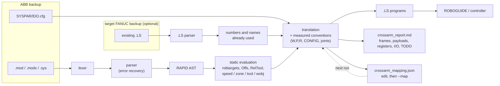

# CrossArm user guide

The [README](../README.md) says what CrossArm does. This guide covers how to use it in detail: what it
reads, what it writes, how to number the programs for your cell, and the choices it makes for you.
How each of those choices was checked is in [validation.md](validation.md).

- [Input: what CrossArm reads](#input-what-crossarm-reads)
- [The window](#the-window)
- [Command line](#command-line)
- [What is converted](#what-is-converted)
- [Reading the report](#reading-the-report)
- [Numbering: mapping file and target robot](#numbering-mapping-file-and-target-robot)
- [The tool on the flange](#the-tool-on-the-flange)
- [Speeds and zones](#speeds-and-zones)
- [How it works inside](#how-it-works-inside)

## Input: what CrossArm reads

An ABB RobotWare 6 or 7 backup (folder or `.zip`), or loose RAPID modules (`.mod`, `.modx`, `.sys`,
`.sysx`, `.prg`). CrossArm recognises the backup layout:
- each robot task (`T_ROB1`, `T_ROB2`...) becomes its own folder of programs;
- all tasks run on one controller, so they share its registers, flags, I/O and program names: two
  tasks never get the same number for different data, and a second `MAIN` is written `MAIN_2`;
- system modules are used as data, and `EIO.cfg` gives the I/O types;
- licences, binaries and other files are ignored.

Optionally, the backup of the FANUC robot the programs will run on (folder, `.zip` or `.LS` files):
see [target robot](#the-fanuc-robot-in-place).

Everything is written to a new `crossarm_<name>` folder next to the input, a previous one never
overwritten:
- the `.LS` programs, one per routine;
- `SETUP_FRAMES.LS`: run once on the robot, it sets every tool and user frame of the report, so none
  has to be typed in on the pendant;
- the report, `crossarm_report.html` (and `.md`);
- `crossarm_mapping.json`, the numbering used, to edit and give back;
- `crossarm_log.txt`.

Everything runs locally: no file leaves the computer.

## The window

`CrossArm.exe` walks through three steps, and each one says what it found before anything is
converted:

1. **ABB program to convert**: a backup folder, a `.zip` or RAPID files. CrossArm reports the robot
   tasks, the number of modules and whether `EIO.cfg` gave the I/O types.
2. **FANUC robot it will run on** (optional, recommended): its backup, so the frames, registers, I/O
   and program names already used on that robot are left alone.
3. **Your numbering** (optional): a `crossarm_mapping.json` from a previous run, edited with your
   cell's numbers.

Then **Convert**. The result says how many programs are ready as is and what to look at first —
anything that would stop the programs loading or running comes before where the manual work is —
with the report one click away. **How it works** in the header explains the outputs and the limits
in plain words. Dropping the backups on the `CrossArm.exe` icon converts them straight away.

The executable is not code-signed. On first launch, SmartScreen may ask for confirmation
(**More info → Run anyway**). Each release ships the SHA-256 of the exe, built by GitHub Actions
from the tagged commit.

## Command line

Python 3.11 or later, no runtime dependency:

```bash
pip install -e ".[dev]"

crossarm convert tests/fixtures/rapid/pick_and_place.mod              # -> crossarm_pick_and_place/
crossarm convert path/to/backup.zip --fanuc path/to/fanuc_backup/      # number around the robot in place
crossarm convert path/to/backup.zip --map mapping.json                 # pin your own numbers
crossarm-gui                                                           # the desktop window
crossarm parse   tests/fixtures/rapid/pick_and_place.mod              # RAPID AST as a readable listing
crossarm stats   backup/RAPID                                          # parser coverage report
```

## What is converted

| RAPID | FANUC TP | Notes |
|---|---|---|
| `MoveJ` / `MoveL` / `MoveC` / `MoveAbsJ` | `J` / `L` / `C` / `J` + local `P[n]` | Targets resolved at conversion time, including `Offs()` and `RelTool()`. Joint targets converted with the measured axis conventions. A `MoveAbsJ` with a stationary tool is made with the tool already selected (a joint target does not depend on it) |
| frame or point the programs compute from fixed values: `tGrip:=MakeTool(tBase,sShift)`, `wB.uframe:=wA.uframe`, `DefFrame`, `PoseMult`, `OrientZYX`… | `UTOOL[n]=PR[m]` / `UFRAME[n]=PR[m]` where the RAPID computes it; a point, moved to with its value | Worked out at conversion time ([below](#frames-and-points-the-programs-compute)), the value kept in a position register `SETUP_FRAMES.LS` sets |
| robtarget quaternion | W, P, R | Fixed-axis XYZ angles |
| `confdata` | `CONFIG 'F/N U/D T/B, t1, t4, t6'` | Measured conventions ([validation](validation.md#3-arm-configuration-measured-on-both-controllers)) |
| `wobjdata` / `tooldata` | `UFRAME_NUM` / `UTOOL_NUM` | Frame values (X Y Z W P R) listed in the report. A frame the programs calibrate themselves: its value saved in the backup, flagged to check |
| tool load (`loaddata`) | PAYLOAD schedule | Mass, centre of gravity and inertia listed in the report, to set up before running |
| `speeddata` | `%` (joint) / `mm/sec` | mm/s kept; joint % from the target robot's measured profile ([speeds and zones](#speeds-and-zones)) |
| `zonedata` | `FINE` / `CNTn` | The CNT that rounds the corner as much at the move's speed, measured on both robots |
| `num` / `bool` data | `R[n:name]` / `F[n]` | |
| `Set` / `Reset` / `SetDO` | `DO[n]=ON/OFF` | Signal types read from the backup's `EIO.cfg` |
| `WaitTime`, `WaitDI/DO`, `WaitUntil` | `WAIT` | |
| wait with `\MaxTime` and the `ERROR` handler's `ERR_WAIT_MAXTIME` case | a loop on a `TIMER`, then the handler's steps (`RETRY` → back to the wait, `TRYNEXT` → past it) | `$WAITTMOUT`, the limit of `WAIT ... TIMEOUT`, is write-protected for programs. A handler that only passes errors on (`RAISE`) needs nothing on FANUC |
| `SetGO`, `GInput()`, a group input read by name | `GO[n]=…`, `GI[n]` | Group signals, typed by `EIO.cfg` |
| `PulseDO` | `DO[n]=PULSE,0.2sec` | Length in tenths of a second, 0.1 to 25.5 s (FANUC's range): rounded, with a warning when that moves it. `PULSE` sets the output ON whatever it was, as `PulseDO\High` |
| `InvertDO` | `DO[n]=(!DO[n])` | |
| `SetAO` | `AO[n]=counts` | A FANUC analog output takes the module's counts: give the counts per RAPID unit in the [mapping file](#the-mapping-file) (`analog_scales`); until then the line stays TODO |
| clocks: `ClkReset`, `ClkStart`, `ClkStop`, `ClkRead` | `TIMER[n]=RESET/START/STOP`, `R[m]=TIMER[n]` | In seconds, as `ClkRead`. The timer the waits with `\MaxTime` use is kept apart |
| `ConfL`, `ConfJ`, `SingArea`, `CirPathMode` | nothing | FANUC does without them: a warning where it does it its own way (`ConfL\Off`: each point keeps its `CONFIG`). `AccSet` / `VelSet` back to their defaults: nothing |
| `TPWrite` | `MESSAGE[…]` | 24 characters max. A value (`\Num`, `ValToStr`…) cannot be displayed: the text is kept and the report lists the value (`"tpwrite_values": "todo"` keeps a TODO instead) |
| `TPErase` | nothing | No equivalent on the FANUC pendant |
| `IF / ELSEIF / ELSE` | `IF (...) THEN / ELSE / ENDIF` | `ELSEIF` unrolled, negations pushed down |
| condition calling the backup's own bool function (`IF HasVision()=TRUE`) | the test the function makes: `IF (DI[5]=OFF)` | For a function that only returns a test, with a remark keeping the RAPID text. `RobOS()` is TRUE (the programs run on a real robot) |
| `FOR` (step ±1), `WHILE` | `FOR R[n]=a TO/DOWNTO b`, `LBL`/`JMP` loop | |
| `TEST` / `CASE` / `DEFAULT` | `SELECT R[n]=1,JMP LBL[2]` / `=2,CALL PICK` / `ELSE,JMP LBL[3]` | One line per `CASE` value; a `CASE` that only calls a routine calls it on its line, the other branches are behind labels. A `TEST` on an argument or a group input selects a copy (`R[n:TestValue]`). On a string, or with a `CASE` value only known at run time: TODO |
| routine call, `Stop`, `RETURN`, `EXIT` | `CALL`, `PAUSE`, `END`, `ABORT` | A routine of a system module the programs call is written too: the robot needs it |
| routine with `num`, `bool`, switch parameters | `CALL NAME(3,(-2.5),1,0)`, read as `AR[n]` | Every argument on every call (a switch as 1 / 0). A parameter the routine changes is copied to a register. Other parameters (robtarget, tooldata, string, INOUT...) stay TODO, with the reason |
| call to a routine that makes one move (`MyMoveL p10,v500,z10,tool1`) | `L P[n] …` | Converted when the routine does nothing else; otherwise listed in the report and converted on request ([`move_routines`](#the-mapping-file)) |
| `IF FALSE` / `WHILE FALSE`, `TEST` on a constant | a remark | Code switched off by hand: left out, `IF TRUE` converted without a test, a `TEST` on a constant as the branch it takes |
| comments | `!remark` | Split to 32 characters, accents folded to ASCII |

**Reported as TODO**:
- routines with other parameters (robtarget, string, INOUT...), `FUNC` doing more than return a test, `TRAP`;
- frames and points computed from data that changes at run time, with that data and where it changes;
  frames **measured on the robot** (`CRobT`, a calibration), with what reads the robot;
- payload changes (`tool.tload`), to redo with the FANUC `PAYLOAD[n]` schedules;
- `AccSet` and `VelSet` that slow the robot down (dropping them would run it faster than the ABB), a
  `SetAO` without its scale, interrupts (`CONNECT`, `ISignalDI`, `TRAP`), which TP has not;
- analog inputs, error handlers beyond wait timeouts (FANUC has no exceptions), `UNDO`, `RECORD` data set at
  run time, `GOTO`, late binding;
- ABB-specific instructions (`Load`/`UnLoad`, `GetSysData`, world zones, calibration functions).

### Frames and points the programs compute

RAPID programs often build a frame rather than declare it: a tool made by a function from a base
tool and an offset, a work object whose `uframe` is copied from another one, a frame from three
points (`DefFrame`), a point put together from a pose. TP cannot do that arithmetic: `PR[1]=PR[2]+PR[3]`
adds component by component, W, P and R included, and TP has no pose product, no inverse and no angle
function ([measured](validation.md#15-frames-and-points-the-programs-compute)). So CrossArm works the
value out at conversion time, when it can be certain of it: every value it reads is

- a `CONST`, or a `PERS` / `VAR` that no program of any task changes: no assignment, no call that
  changes it through a `VAR`, `PERS` or `INOUT` parameter, no error handler, no `SetDataVal` on its type;
- or data the routine itself set earlier on every path to that point: set in one branch of an `IF`
  only, in a loop, or before a call that may change it, it is not known after.

A tool or work object computed that way is loaded where the RAPID computes it, `UTOOL[3]=PR[95]`,
from a position register `SETUP_FRAMES.LS` sets; each distinct value gets one register, the free ones
after the frame banks, from the top down (`frame_registers` in the mapping file pins them). A point
computed that way is moved to with its value. A function of the backup is run on the values when it
only computes (no instruction, no change to other data).

Anything else stays TODO, and the report says which input is not fixed and where it changes, or that
the value is **measured on the robot**: a calibration reading `CRobT`, and every frame derived from
it. TP can read the robot's pose (`PR[n]=LPOS`) but not compute a frame from it: such a frame is set
again on the FANUC with its frame setup (3- or 4-point user frame, 6-point tool frame), or in KAREL.

## Reading the report

A large backup produces hundreds of TODO entries that come down to a handful of causes, so the
report opens with a summary rather than the line-by-line list: how many programs converted with no
TODO at all, then the causes ranked by how much code each one blocks. Two or three causes often
account for most of the work left.

A TODO count says how many places need work, not how much of the backup is done: one TODO can stand
for one line or for a whole `IF` block. So the report also counts RAPID instructions, by area
(motion, I/O, program flow, data, calls, messages, error handling), and gives the share written as
TP. An instruction inside a block that became a TODO counts as not converted, and so do the routines
left out; the window shows the overall figure next to the TODO count.

It also compares what the conversion allocated with what the controller holds. Numbers are handed
out from 1 up with no upper bound, so a large backup can ask for `UTOOL_NUM=19` when a standard
controller has ten tool frames. Frames past the limit are kept in position registers the robot does
not use, and loaded into one reserved number before each use; the report says which register holds
which frame. A controller can hold more frames, raised at a Controlled Start
(`$SCR.$MAXNUMUTOOL`, `$SCR.$MAXNUMUFRAM`): with that number under `limits` in the mapping file,
every frame is selected directly.

The report also lists the frames and payloads to set up, the frames the programs compute and the
register each is kept in, the registers, flags and I/O used, every point, and how each speed and zone
was written ([speeds and zones](#speeds-and-zones)). The position registers CrossArm takes (the one
`SETUP_FRAMES.LS` works with, the frame banks, the computed frames) are counted against what the
controller holds, with those the robot's own programs use.

## Numbering: mapping file and target robot

### The mapping file

Register, I/O and frame numbers are allocated automatically in order of first use. That almost
never matches the target cell, so **every conversion writes the numbering it used** to
`crossarm_mapping.json`, next to the report. Edit the numbers to the ones the controller already
has, then convert again with `--map` on that file:

```bash
crossarm convert backup/                                  # writes crossarm_mapping.json
crossarm convert backup/ --map crossarm_<name>/T_ROB1/crossarm_mapping.json
```

On a large backup that file comes out with dozens of numbers already filled in — signals,
frames and registers — which is the part nobody wants to transcribe by hand. Keys starting with
`_` are ignored, so the file can explain itself. Given back its mapping file, a later 1.x version
gives the same numbers ([what 1.x keeps](../CHANGELOG.md#100--2026-09-26)).

A mapping file can also be written from scratch, with only the keys you care about:

```json
{
  "registers": {"nCycles": 10},
  "digital_outputs": {"DO_GripperClose": 3},
  "uframes": {"wobjFixture": 2},
  "utools": {"tGripper": 1},
  "joint_speed_ref_mm_s": 4500,
  "zone_mapping": "measured",
  "config_mapping": true,
  "joint_mapping": true,
  "tool_pin": "-x",
  "group_outputs": {"goStatus": 1},
  "analog_outputs": {"aoGlueFlow": 1},
  "analog_scales": {"aoGlueFlow": 409.5},
  "timers": {"ckCycle": 1},
  "tpwrite_values": "text",
  "program_name_max_length": 8,
  "limits": {"UFRAME": 9, "UTOOL": 10, "R": 200, "PR": 100, "F": 1024},
  "reserved": {"DO": [1, 2, 3], "UTOOL": [1]},
  "move_routines": {"MoveL_Side": true},
  "frame_registers": {"10,-5,215,0,0,25": 95}
}
```

- `limits` is what the controller actually holds; the report flags any resource the conversion
  allocates past it. The defaults above are those of a standard controller — options raise several
  of them, so check yours and adjust.
- `reserved` lists numbers already in use when you know them but have no backup of the controller
  to hand.
- `joint_speed_ref_mm_s`, `zone_mapping` and `motion_profile`: see [speeds and zones](#speeds-and-zones).
- `tool_pin`: see [the tool on the flange](#the-tool-on-the-flange).
- `move_routines` is for the integrator's own move instructions: a routine taking a point, a speed,
  a zone and a tool that makes one `MoveL` with them, and does something else too, such as
  choosing a station before moving. Converting a call as the plain move leaves that out, so it is
  your decision:
  the generated mapping file lists these routines set to `false`, the report says what each one
  does besides the move, and `true` converts their calls. In the window, **choose which to
  convert** in the result does the same with check boxes.
- `analog_scales` gives, per analog output, the FANUC counts for one unit of the RAPID value: a
  FANUC `AO` takes the module's counts (0-4095 for 0-10 V on many modules, see its manual), RAPID a
  logical value. `SetAO aoGlueFlow,4.5` with 409.5 is `AO[1]=1843`. The generated file lists each
  analog output with `null`: until a number replaces it, `SetAO` on that signal stays TODO.
- `frame_registers` gives the position register that keeps each
  [frame the programs compute](#frames-and-points-the-programs-compute), by its value X, Y, Z, W, P, R
  as the report writes it. The generated file lists them; change a number to a register the robot
  does not use.

### The FANUC robot in place

A migration lands on a robot that already has tool frames, registers, I/O and programs. Give
CrossArm that controller's backup and it works around them:

```bash
crossarm convert abb_backup/ --fanuc fanuc_backup/       # folder, .zip or .LS files
crossarm convert abb_backup/ fanuc_backup/               # the same: FANUC programs are recognised
```

In the window, choose it in step 2 or drop both backups together. The FANUC programs are not
converted; they are read with the `.LS` parser for every UFRAME, UTOOL, R, PR, F, DO, DI, GO and GI
number they touch, and for their names. Automatic numbering then never lands on those, a program
that would replace one of the robot's is renamed, and the report's capacity table gains a
**Taken** column. A number you pin in the mapping file onto a taken one is kept — often it is the
same physical signal on the new cell — but reported, with the programs that already use it.

CrossArm also reads the robot model in that backup (`orderfil.dat`, `dcsvrfy.dg`), to use the speeds
and zones measured on its series.

## The tool on the flange

Simulation shows where each controller puts its flange frame, not where a tool sits on the metal.
That comes from the makers' manuals:

| | ABB IRB 6700 | FANUC M-20iD/25 |
|---|---|---|
| mounting | Ø160 pitch circle, 11 × M12, one Ø12 H7 guide pin hole | Ø64 pitch circle, 14 × M4, two Ø4 H7 pin holes |
| pin hole | up at the calibration position: **−x** of `tool0` | on **+x and −x** of the faceplate frame (x up at all axes 0) |

The flanges have nothing in common, so an ABB tool goes on a FANUC robot through an adapter plate,
and the plate decides which way round the tool sits. With the measured axis conventions, the two
flange frames coincide in space for the same TCP pose, so the FANUC hole on −x is where the ABB pin
was: that is CrossArm's default, the tool frames as they are (`"tool_pin": "-x"`). ISO 9409-1 puts
the pin of a standard flange on +x; with the pin there (`"tool_pin": "+x"`), the tool is half a turn
about z from the flange frame, and CrossArm turns every tool frame and payload centre (x and y change
sign), the J6 turn number and the J6 of joint targets (`-J6` instead of `180 - J6`). The report says
which one was used. Sources: IRB 6700 product manual (3HAC044266-001, *Tool flange, standard*),
M-20iD mechanical unit operator's manual (B-84074EN, fig. 3.1 (b) and 4.1 (a)).

## Speeds and zones

Neither has an exact equivalent between the two brands, and both depend on the robot, so CrossArm
converts them with a **motion profile measured** on both simulators
([validation](validation.md#12-speeds-and-zones-measured-on-both-robots)):

- **Linear and circular moves** keep their speed in mm/s: at the same speed they take as long on
  both robots.
- **Joint moves**: `%` = RAPID TCP speed / the TCP speed a J 100 % move reaches on the target robot
  (`joint_speed_ref_mm_s`): 4,500 mm/s on an M-20iD/25, 3,400 on an R-1000iA/80F, 2,000 on an
  R-2000iC/190S. A joint move can take 20 % more or less time than on the ABB, depending on the path.
- **Zones**: a RAPID zone rounds a corner by about the same distance at any speed; a CNT by more the
  faster the move. So each zone is written as the smallest CNT that rounds a right-angle corner as
  much as the RAPID zone at the move's speed: on an M-20iD/25, `z10` is `CNT97` at 200 mm/s,
  `CNT54` at 500, `CNT31` at 1000. Into a faster move the FANUC rounds more, so there the CNT is
  matched at the next move's speed (looking past outputs and remarks). Where even `CNT100` rounds
  less than the RAPID zone, CNT100 is written and the report says so: the FANUC path stays closer to
  the point.

The report gives, for each zone and speed used, the CNT written and both corner cuts.

**Which profile.** Given the FANUC robot's backup, CrossArm reads its model and takes the profile
measured on that series: M-20iD (and the ARC Mate 120iD, the same arm), R-2000iC or R-1000iA. For
any other robot it keeps the M-20iD/25 profile and says so, in the report and the window: another
arm can differ by twice as much. [tools/probe_motion.py](../tools/probe_motion.py) measures a new
profile in about 15 minutes of simulation, and `motion_profile` in the mapping file (the output of
`probe_motion.py fit`) brings it in. `"zone_mapping": "linear"` goes back to the old rule,
`CNT = zone radius x cnt_per_mm`.

**How close.** The points are exact; how the robot moves between them cannot be. CrossArm aims for a
path within 10 mm of the ABB's, since the points are touched up on the robot anyway. Measured, it
stays within 4 mm: on the way down onto a part the FANUC keeps to the line at least as long as the
ABB, and the largest gap is a zoned reversal (down and back up through a zone), which turns up to
4 mm shorter of the bottom ([validation](validation.md#13-the-path-where-zones-matter)).

## How it works inside



Pure Python, no runtime dependency. See also the [design notes](design.md) and the
[`.LS` format status](fanuc_ls_format.md).
